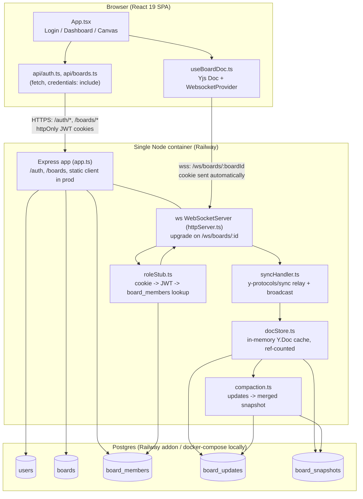
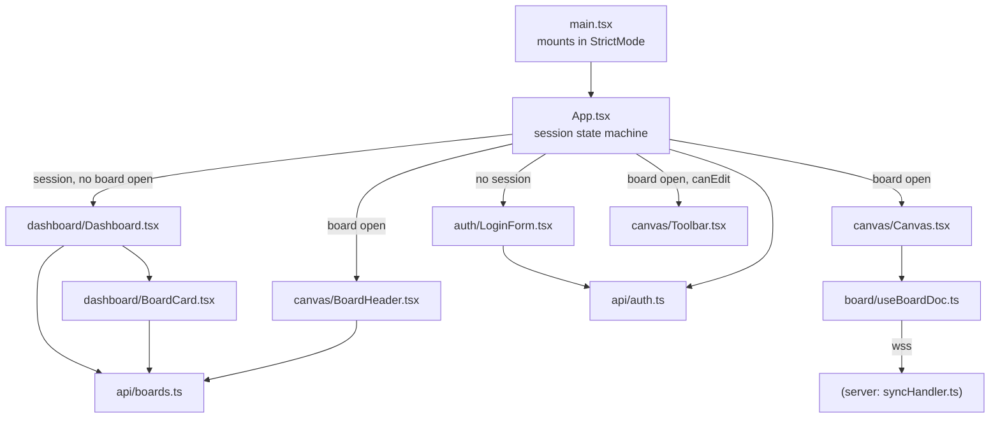

# Whiteboard — System Design (Current State)

> This document describes the system **as it is built today**. It is not a proposal. Where a feature is visible in the UI but not functional, that is called out explicitly rather than described as if it worked.

## 1. Overview

Whiteboard is a Google-Docs-style collaborative whiteboard app: users sign up with email/password, land on a board dashboard, and open boards to draw shapes on a real-time synced canvas with other collaborators. The stack is a React 19 + Vite SPA client, an Express 4 API server, a hand-rolled WebSocket layer built on `ws` + Yjs for CRDT sync, and Postgres (via Drizzle ORM) for both relational data (users/boards/membership) and CRDT persistence (append-only update log + periodic snapshot compaction). The whole app — API, WebSocket, and the built client's static files — runs as a **single Node process in a single Docker container**, deployed to Railway with a managed Postgres addon.

## 2. High-Level Architecture



Key architectural facts, not visible from the diagram alone:

- **One process, two protocols.** `httpServer.ts` builds a plain `node:http` server from the Express app and attaches a `WebSocketServer` to its `upgrade` event by hand — there is no separate WS process or port.
- **No REST session endpoint gates the socket.** The WebSocket upgrade handler re-derives identity from the `access_token` cookie on every connection attempt (browsers attach cookies to same-origin WS handshakes automatically), so the client never has to pass a token explicitly.
- **`roleStub.ts` is not a stub despite the name.** It does a real DB lookup against `board_members` to resolve the caller's role (`owner`/`editor`/`viewer`) for the specific board in the URL. A `viewer` connection is accepted, but `syncHandler.ts` drops any mutating message before it reaches the shared `Y.Doc` — enforcement happens twice (silently for UX, then authoritatively at the transport layer).
- **In production, the same Express process serves the built client** (`express.static` + catch-all `sendFile` of `index.html`) — no CDN, no separate static host.

## 3. Data Model

All tables are defined in `server/src/db/schema.ts` (Drizzle ORM, `pg-core`). Binary columns use a hand-rolled `bytea` custom type.

```mermaid
erDiagram
    users ||--o{ board_members : "has membership"
    boards ||--o{ board_members : "has member"
    boards ||--o{ board_updates : "has update log"
    boards ||--|| board_snapshots : "has compacted snapshot"

    users {
        uuid id PK
        text email UK
        text name
        text password_hash "nullable"
        text google_id UK "nullable, unused today"
        timestamptz created_at
    }
    boards {
        uuid id PK
        text title "default 'Untitled board'"
        bytea thumbnail "nullable PNG bytes"
        timestamptz created_at
        timestamptz updated_at
    }
    board_members {
        uuid user_id PK_FK
        uuid board_id PK_FK
        board_role role "owner | editor | viewer"
    }
    board_updates {
        bigserial id PK
        uuid board_id FK
        bytea update "raw Yjs update"
        timestamptz created_at
    }
    board_snapshots {
        uuid board_id PK_FK
        bytea snapshot "merged Yjs state"
        timestamptz updated_at
    }
```

Notes:

- `board_members` has a **composite primary key** `(user_id, board_id)` — one role per user per board, enforced at the schema level (not just in application code).
- All four foreign keys (`board_members.user_id/board_id`, `board_updates.board_id`, `board_snapshots.board_id`) are `ON DELETE CASCADE` (added in migration `0003_faithful_guardian.sql`). Deleting a `boards` row cleans up everything else with no application-level cleanup code — confirmed by the comment in `boards/routes.ts`'s `DELETE /:id` handler.
- `board_updates` has an index on `(board_id, id)` — the ordering column, used to replay updates in the order they arrived.
- `users.google_id` exists in the schema but there is **no code path that ever sets it** — Google OAuth is schema-ready but not implemented (see §8).
- There is no `deleted_at`, `starred`, `space_id`, or any comments/version-history table anywhere in the schema — the Dashboard/Canvas UI sections that reference those concepts (Trash, Starred, Spaces, Comments, Version History) are not backed by any persisted data.

Migrations (`server/drizzle/*.sql`, applied in order via `drizzle-kit`/`migrate.ts`):

| File | What it does |
|---|---|
| `0000_kind_vulcan.sql` | Initial schema: `users` table. |
| `0001_groovy_scrambler.sql` | Adds `boards` and `board_members` (+ `board_role` enum). |
| `0002_nosy_masque.sql` | Adds `board_updates` and `board_snapshots` for CRDT persistence. |
| `0003_faithful_guardian.sql` | Drops and re-adds all board-related foreign keys with `ON DELETE CASCADE`. |

## 4. REST API Surface

All routes read directly from `server/src/auth/routes.ts` and `server/src/boards/routes.ts`. `boardsRouter.use(requireAuth)` gates every `/boards/*` route on a valid `access_token` cookie; `/auth/*` routes are individually gated (only `/auth/me` requires auth).

### `/auth` (`auth/routes.ts`)

| Method | Path | Auth | Purpose |
|---|---|---|---|
| POST | `/auth/signup` | none | Create a user (email/name/password ≥ 8 chars), hash password with bcrypt, set session cookies. 409 on duplicate email. |
| POST | `/auth/login` | none | Verify email + password, set session cookies. 401 on any mismatch (no user-enumeration distinction). |
| GET | `/auth/me` | cookie | Return `{id, email, name}` for the signed-in user, or 401. |
| POST | `/auth/refresh` | refresh cookie | Reads `refresh_token` cookie directly (not via `requireAuth`), issues a new `access_token`. **Not rotated** — a `ponytail:` comment in the code flags this as a deliberate simplification. |
| POST | `/auth/logout` | none | Clears both cookies. |

Cookies: `access_token` (15 min TTL) and `refresh_token` (30 day TTL), both `httpOnly`, `sameSite: lax`, `secure` in production. Signed with `JWT_SECRET` (`jsonwebtoken`); payload is just `{ sub: userId }`.

### `/boards` (`boards/routes.ts`, all routes behind `requireAuth`)

| Method | Path | Role required | Purpose |
|---|---|---|---|
| POST | `/boards` | any signed-in user | Create a board, insert an `owner` membership row, both in one DB transaction. |
| GET | `/boards` | any (returns only boards the caller is a member of) | List boards via an inner join on `board_members`, with `thumbnail` re-encoded as a `data:image/png;base64,...` string. |
| POST | `/boards/:id/thumbnail` | any member | Upload a canvas snapshot (data URL) as the board's thumbnail. |
| PATCH | `/boards/:id` | editor or owner (403 for viewer) | Rename a board. |
| DELETE | `/boards/:id` | owner only (403 otherwise) | Delete a board; cascades clean up members/updates/snapshot. |
| POST | `/boards/:id/members` | owner only | Add or update a member's role by email. **Requires the invitee already have an account** — 404 if no user matches that email. No email is sent. |

**Explicitly does not exist:** `GET /boards/:id/members` (list members) and `DELETE /boards/:id/members/:userId` (remove a member) — confirmed absent from the router. The client has no way to see or remove collaborators once added.

## 5. WebSocket / Real-Time Sync Protocol

**Connection path:** `wss://<host>/ws/boards/:boardId` (dev: proxied through Vite to `ws://localhost:3001`, see `vite.config.ts`).

1. **Upgrade-time auth** (`httpServer.ts` → `roleStub.ts`): on the raw HTTP `upgrade` event, `authenticateWSRequest` parses `boardId` out of the URL, reads the `access_token` cookie, verifies the JWT, and looks up `board_members` for `(userId, boardId)`. No membership row → `401` and the socket is destroyed before `ws` ever takes it over. A match returns `{ boardId, role }`.
2. **Per-board `Y.Doc` cache** (`docStore.ts`): `acquireDoc(boardId)` is ref-counted — the first connection for a board loads it from Postgres (inside a **`REPEATABLE READ`, read-only transaction**, deliberately, per an in-code comment: without that isolation level a concurrent compaction could be read half-applied), later connections reuse the same in-memory `Y.Doc`. `releaseDoc` decrements the ref count and evicts the doc when the last socket for that board closes.
3. **Sync handshake** (`syncHandler.ts`): on connect the server immediately sends a `y-protocols/sync` `SyncStep1`. Inbound `SyncStep1`/`SyncStep2`/`Update` messages are handled per the standard Yjs wire protocol (`lib0/encoding`+`decoding` framing, message type `0` = sync).
4. **Write enforcement:** any mutating sync message (`SyncStep2` or `Update`) is dropped **before touching the doc** if the connection's role is `viewer` — this is the authoritative enforcement point; the client's own read-only UI gating is only a UX nicety on top of it.
5. **Persistence + broadcast:** an accepted update is (a) appended to `board_updates` as a raw byte blob via `persistUpdate`, and (b) relayed to every other open socket on that board (`broadcast`, excluding the sender).
6. **Awareness (presence) messages** (message type `1`) are relayed opaquely to all sockets including the sender — this is required just to keep `y-websocket` client-side connections alive (its client auto-closes after 30s of silence), but **no cursor/presence UI consumes this data today**. Presence is wire-compatible but not implemented on the client.
7. **Compaction** (`compaction.ts`): when the last socket for a board disconnects, `compactBoard` runs — it locks the existing snapshot row (`FOR UPDATE`), replays snapshot + all pending updates into a fresh `Y.Doc`, writes the merged state back as the new snapshot, and deletes exactly the update rows it merged, all in one transaction.

Client side (`client/src/board/useBoardDoc.ts`): wraps a `Y.Doc` + `y-websocket`'s `WebsocketProvider` in a hook. It exposes a flat `shapes: ShapeObj[]` array (mirrored from a Yjs `Map` via `observeDeep`), plus `upsertShape`/`removeShape`/`getShape`. `getShape` intentionally reads the live Yjs map rather than the React-state mirror, since the mirror can lag a render behind — `Canvas.tsx` relies on this to avoid persisting a stray zero-size shape when a draw gesture finishes very fast.

## 6. Client Architecture



- **`App.tsx`** is the single top-level state machine: `checkingSession` (calls `api/auth.ts#me()` once on mount) → `me === null` renders `LoginForm` → `me` set and no `openBoard` renders `Dashboard` → `openBoard` set renders `BoardHeader` + `Canvas` + (`Toolbar` if the role can edit). `handleBack` captures a canvas thumbnail (`Canvas`'s imperative `captureThumbnail`) and uploads it via `api/boards.ts#uploadThumbnail` before returning to the dashboard — this is why leaving a board updates its dashboard card image.
- **`auth/LoginForm.tsx`** — real email/password login and signup (toggled by local `mode` state), calling `api/auth.ts`. The "Continue with Google" button is rendered `disabled` — no OAuth flow is wired up client or server side.
- **`dashboard/Dashboard.tsx`** — sidebar (brand mark, disabled search, real "New board" button, Home/Recent/Shared nav — all backed by client-side filter/sort over one `listBoards()` call — plus disabled Templates/Starred/Trash nav items) and a top bar (real sort toggle Last-edited/Alphabetical, a grid/list view toggle where only grid is functional). Renders one `BoardCard` per board.
- **`dashboard/BoardCard.tsx`** — real Rename (`renameBoard`), Share (`inviteMember`), and Delete (`deleteBoard`) via a "⋯" menu; a disabled star button; a deterministic flat decorative thumbnail (`ThumbArt`, keyed by a hash of the board id) used whenever `board.thumbnail` is null.
- **`canvas/BoardHeader.tsx`** — real title display + inline rename, a real Share popover (`inviteMember`), a real Delete via the "⋯" menu (`deleteBoard`, owner-gated), and disabled Comment/History/Present icon buttons plus disabled Duplicate/Move/Export menu items. The "Saved" indicator is static text (sync is continuous via Yjs, there is no dirty-state tracking to reflect).
- **`canvas/Canvas.tsx`** — a `react-konva` `Stage`/`Layer` bound to `useBoardDoc`'s `shapes` array. Owns pointer-driven shape drawing (rect/ellipse/text), a Konva `Transformer` for resize (rotation disabled) — text shapes resize like rect/ellipse (corner handles scale both dimensions, edge handles scale one) and word-wrap to the resized width — a `captureThumbnail` imperative handle, undo/redo (`Cmd/Ctrl+Z` for undo, `Cmd/Ctrl+Y` for redo) and delete-the-selected-shape (`Delete`/`Backspace`) — both suppressed whenever an editable field is focused (the text-edit overlay, the board title rename input, the share popover's email field) so they don't fight normal typing/native undo there, and a self-contained zoom stepper (in/out/fit-to-screen) that manipulates the Konva stage's own scale/position directly — no server-side notion of zoom exists. Text editing is a plain `contentEditable` `<div>` absolutely positioned over the Stage (free-form, no wrap, grows with typed content) that swaps for a static Konva `Text` node on blur.
- **`board/useBoardDoc.ts`** — beyond the `shapes` mirror and `upsertShape`/`removeShape`/`getShape`, also owns a `Y.UndoManager` scoped to the `shapesMap`, recreated alongside the `Y.Doc`/provider per board. Because Yjs's default `trackedOrigins` is `[null]` (the origin of our own local `transact()` calls) and remote updates arrive with the `WebsocketProvider` as origin, undo/redo is automatically scoped to the local client's own edits — a collaborator's changes are never undone by someone else's Ctrl+Z. Exposes `undo`/`redo`/`canUndo`/`canRedo`, the latter two kept in sync via the manager's `stack-item-added`/`stack-item-popped` events.
- **`canvas/Toolbar.tsx`** — the floating tool pill. `select`, `rect`/`ellipse` (behind a "Shapes" flyout that also shows disabled Line/Star/Hexagon icons), and `text` are wired to the real `Tool` union, plus real Undo/Redo buttons (disabled based on `canUndo`/`canRedo`); every other icon (Pen, Eraser, Arrow, Sticky, Table, Frame, Image, Comment) is rendered `disabled`.
- **`canvas/types.ts`** — the entire shared vocabulary for canvas state: `Tool = "select" | "rect" | "ellipse" | "text"` and `ShapeObj = {id, type, x, y, width, height, text?, fontSize?}`. No fill/stroke/rotation/layer fields exist on `ShapeObj` today — shape color is hardcoded in `Canvas.tsx`'s render, not per-shape data, and all shapes render in creation order (no z-order concept — see Tier 5 backlog).
- **`api/auth.ts`** / **`api/boards.ts`** — thin `fetch` wrappers (`credentials: "include"`) around the REST surface in §4, with one shared `parseJsonOrThrow` helper per file.
- **`App.css`** / **`styles/tokens.css`** — one global stylesheet plus a CSS custom-property design-token file; no CSS-in-JS, no component-scoped styles anywhere in the client.

## 7. Full File Inventory

```
.
├── .dockerignore                        — excludes node_modules/dist/etc. from the Docker build context
├── .env.example                         — documents server env vars (PORT, DATABASE_URL, JWT_SECRET, unused R2_* image-upload vars)
├── .gitignore                           — node_modules, dist, .env, *.log, and (added this session) the gitignored design-handoff docs folder
├── .vscode/settings.json                — editor settings, no app relevance
├── Dockerfile                           — single-stage Node 22 Alpine build: npm ci at workspace root, npm run build, boots via `migrate.js && index.js`
├── README.md                            — one-line project description
├── Whiteboard_Connect.session.sql       — ad hoc scratch SQL file from prior DB debugging (Postgres size queries etc.), not part of the app
├── docker-compose.yml                   — local Postgres 16 only (whiteboard/whiteboard/whiteboard), no app services
├── package.json                         — npm workspaces root (`client`, `server`); dev/build/start scripts fan out to both workspaces
├── package-lock.json                    — npm lockfile for the whole workspace
├── railway.json                         — tells Railway to build via the Dockerfile and restart on failure (max 3 retries)
│
├── docs/
│   ├── superpowers/
│   │   ├── specs/2026-08-19-realtime-collaboration-design.md   — original design spec for the Yjs sync engine phase
│   │   └── plans/2026-08-20-realtime-collaboration.md          — implementation plan derived from that spec
│   └── system-design/architecture.md    — this document
│   (docs/design_handoff_whiteboard_redesign/ exists on disk but is gitignored — the Claude-Design mockups used as the visual spec for the Login/Dashboard/Canvas redesign)
│
├── client/
│   ├── .gitignore, .oxlintrc.json, README.md, tsconfig*.json, vite.config.ts, package.json  — standard Vite/React/TS project scaffolding; vite.config.ts additionally proxies /ws, /auth, /boards to the dev server on :3001
│   ├── index.html                       — SPA shell; loads Public Sans from Google Fonts, mounts #root
│   ├── public/favicon.svg               — static favicon
│   └── src/
│       ├── main.tsx                     — React entry point; imports tokens.css, index.css, mounts <App />
│       ├── index.css                    — global reset + body defaults (font/color/background from tokens)
│       ├── App.tsx                      — top-level session/board state machine (see §6)
│       ├── App.css                      — the single global stylesheet: auth screen, dashboard, board cards, canvas chrome, toolbar, header, zoom stepper
│       ├── styles/tokens.css            — CSS custom properties: spacing/type/radius/shadow scale, plus the Public-Sans-era redesign palette (ink/border/accent/danger tokens) and canvas-specific bg/dot tokens
│       ├── api/
│       │   ├── auth.ts                  — signup/login/logout/me fetch wrappers, `Me` type
│       │   └── boards.ts                — listBoards/createBoard/uploadThumbnail/renameBoard/deleteBoard/inviteMember fetch wrappers, `BoardSummary`/`BoardRole` types
│       ├── auth/
│       │   └── LoginForm.tsx            — real login/signup form; disabled Google SSO button (see §6)
│       ├── dashboard/
│       │   ├── Dashboard.tsx            — sidebar + top bar + board grid (see §6)
│       │   └── BoardCard.tsx            — individual board card: real rename/share/delete, disabled star, decorative fallback thumbnail
│       ├── canvas/
│       │   ├── types.ts                 — `Tool` union and `ShapeObj` interface, the entire canvas data model
│       │   ├── Canvas.tsx               — react-konva stage, shape drawing/selection/transform, zoom stepper, thumbnail capture
│       │   ├── Toolbar.tsx              — floating tool pill (real select/rect/ellipse, everything else disabled)
│       │   └── BoardHeader.tsx          — board header chrome: back, title/rename, Saved indicator, Share popover, "⋯" menu
│       └── board/
│           └── useBoardDoc.ts           — Yjs Y.Doc + WebsocketProvider hook bridging Canvas to the server's sync protocol
│
└── server/
    ├── .env                             — local secrets (DATABASE_URL/JWT_SECRET for dev); gitignored, not read for this document
    ├── package.json, tsconfig*.json, vitest.config.ts, drizzle.config.ts  — server project scaffolding, test runner config, and drizzle-kit config (points at db/schema.ts and server/drizzle/)
    └── src/
        ├── index.ts                     — process entry point: builds the server via httpServer.ts and calls .listen()
        ├── httpServer.ts                — builds the combined HTTP+WS server; owns the `upgrade` handler that authenticates and hands off to syncHandler (see §5)
        ├── app.ts                       — builds the Express app: JSON body parsing, /health, mounts authRouter/boardsRouter, serves the built client in production, last-resort error middleware
        ├── asyncHandler.ts              — wraps async Express route handlers so a rejected promise reaches error middleware instead of becoming an unhandled rejection
        ├── auth/
        │   ├── routes.ts                — /auth/* endpoints (see §4)
        │   ├── routes.test.ts           — tests signup/login/me/refresh/logout behavior and error cases
        │   ├── middleware.ts            — cookie parsing + `requireAuth` Express middleware
        │   ├── jwt.ts                   — sign/verify access & refresh JWTs (HS256 via `JWT_SECRET`), TTL constants
        │   ├── jwt.test.ts              — round-trip + expiry/tamper tests for jwt.ts
        │   ├── password.ts              — bcrypt hash/verify wrappers (10 salt rounds)
        │   └── password.test.ts         — hash/verify correctness tests
        ├── boards/
        │   ├── routes.ts                — /boards/* endpoints (see §4)
        │   └── routes.test.ts           — tests board CRUD, role-based 403s, and the members-invite endpoint
        ├── db/
        │   ├── schema.ts                — Drizzle table definitions (see §3)
        │   ├── index.ts                 — `drizzle(pool, {schema})` — the shared `db` client every route/module imports
        │   ├── pool.ts                  — `pg.Pool` constructed from `DATABASE_URL`
        │   ├── migrate.ts               — runs drizzle-kit migrations; also directly runnable as a CLI entry point (used by the Dockerfile's boot command)
        │   └── migrate.test.ts          — verifies migrations apply cleanly against a real Postgres
        └── ws/
            ├── roleStub.ts              — WebSocket upgrade-time auth: cookie → JWT → board_members role lookup (see §5)
            ├── roleStub.test.ts         — tests auth success/failure paths (bad cookie, no membership, malformed board id)
            ├── syncHandler.ts           — per-connection sync protocol handling, broadcast, persistence trigger (see §5)
            ├── syncHandler.test.ts      — tests message framing, viewer write-rejection, broadcast fan-out
            ├── docStore.ts              — in-memory ref-counted Y.Doc cache + Postgres load/persist (see §5)
            ├── docStore.test.ts         — tests acquire/release ref-counting and load-from-DB behavior
            ├── compaction.ts            — merges board_updates into board_snapshots on last-socket-disconnect (see §5)
            ├── compaction.test.ts       — tests merge correctness and that only merged rows are deleted
            └── integration.test.ts      — end-to-end test: two real WebSocket clients syncing through the real server + a real Postgres

server/drizzle/
    ├── 0000_kind_vulcan.sql .. 0003_faithful_guardian.sql   — applied SQL migrations (see §3 table)
    └── meta/*.json                       — drizzle-kit's internal snapshot/journal bookkeeping for the above migrations
```

## 8. Build & Deploy

- **Local dev:** `docker-compose up` for Postgres only; `npm run dev:server` (tsx watch, loads `server/.env`) and `npm run dev:client` (Vite dev server) run as two separate processes, with Vite proxying `/ws`, `/auth`, `/boards` to `:3001` (`vite.config.ts`).
- **Production build:** `npm run build` at the workspace root runs `tsc -b && vite build` for the client and `tsc` for the server, producing `client/dist` (static assets) and `server/dist` (compiled JS).
- **Container:** the `Dockerfile` is a single Node 22 Alpine stage. It installs all workspace dependencies (`npm ci` off just the `package.json` manifests, so this layer caches independent of source changes), copies the full source, builds both workspaces, and boots with `node server/dist/db/migrate.js && node server/dist/index.js`. Running the migrator on every boot is intentionally idempotent — it's what creates the schema on a brand-new database and is a no-op on subsequent deploys.
- **Static serving:** in production (`NODE_ENV=production`), `app.ts` serves `client/dist` directly via `express.static` plus a catch-all route to `index.html` — the same process answers `/health`, `/auth/*`, `/boards/*`, the WebSocket upgrade, and the SPA itself. There is no separate CDN/static host.
- **Railway:** `railway.json` pins the builder to the Dockerfile and sets a restart-on-failure policy (max 3 retries). Postgres is provisioned as a Railway addon; `DATABASE_URL`/`JWT_SECRET`/`PORT` are supplied as Railway environment variables (mirrored in `.env.example` for local dev).

## 9. Not Yet Implemented

The tiered backlog agreed earlier this session, annotated with which currently-real file(s) each item would touch:

**Tier 1 — Core usability gaps**
- Board member management (no way to see or remove board members — invites are add-only and require the invitee to already have an account, confirmed via `boards/routes.ts`) → new `GET/DELETE /boards/:id/members` routes in `server/src/boards/routes.ts`, plus UI in `client/src/canvas/BoardHeader.tsx` and/or `client/src/dashboard/BoardCard.tsx`
- Password reset flow (inert "Forgot password?" link) → `client/src/auth/LoginForm.tsx`, new server routes alongside `server/src/auth/routes.ts`, needs an email-sending mechanism

**Tier 2 — Collaboration polish**
- Live cursors/presence (Yjs awareness not wired up) → `client/src/board/useBoardDoc.ts` (awareness API), `client/src/canvas/Canvas.tsx` (render cursors) — the server already relays awareness frames opaquely in `server/src/ws/syncHandler.ts`
- Real invite emails (invite silently requires the invitee already has an account, no email sent) → `server/src/boards/routes.ts` (`POST /:id/members`), needs an email-sending mechanism

**Tier 3 — Expanded canvas toolset**
- Sticky notes (+ color flyout) → `client/src/canvas/types.ts`, `Canvas.tsx`, `Toolbar.tsx`
- Pen/freehand drawing → same three files, needs a `points`-based shape type
- Eraser → `Canvas.tsx`
- Additional shapes (line, arrow/connector, star, hexagon) → `types.ts`, `Canvas.tsx`, `Toolbar.tsx`'s existing (currently disabled) shapes-flyout entries
- Frame tool → `types.ts`, `Canvas.tsx`, `Toolbar.tsx`
- Image upload/embed → `types.ts`, `Canvas.tsx`, `Toolbar.tsx`, plus server-side storage (the unused R2_* env vars in `.env.example` suggest Cloudflare R2 was the intended target)
- Table tool → `types.ts`, `Canvas.tsx`, `Toolbar.tsx`

**Tier 4 — Dashboard organization**
- Search boards → `client/src/dashboard/Dashboard.tsx` (currently a disabled input)
- Trash/soft-delete → `server/src/db/schema.ts` (`deletedAt` column), `boards/routes.ts`, `client/src/dashboard/Dashboard.tsx`
- Starred boards → `server/src/db/schema.ts` (`starred` column), `boards/routes.ts`, `client/src/dashboard/BoardCard.tsx` (star button already exists, disabled)
- List view toggle → `client/src/dashboard/Dashboard.tsx` (grid button already wired, list is a no-op)
- Templates → `client/src/dashboard/Dashboard.tsx`, needs template source data
- Spaces (needs schema work) → `server/src/db/schema.ts` (new `space_id`/table), `boards/routes.ts`, `client/src/dashboard/Dashboard.tsx`
- Workspace switcher (multi-workspace) → new schema entirely, `client/src/dashboard/Dashboard.tsx`

**Tier 5 — Canvas power features**
- Layering / z-order — assign any object (shape, text, sticky note, image, etc.) to a numbered layer; layer 0 is the base, each higher layer renders on top of the ones below it → `client/src/canvas/types.ts` (needs a `layer`/`zIndex` field on `ShapeObj`), `Canvas.tsx` (sort shapes by layer before rendering each `Layer`'s children, plus "send to back"/"bring to front"/"send backward"/"bring forward" actions), new UI to assign/change an object's layer (context menu or the Inspector panel below)
- Inspector panel (position/fill/stroke/corner-radius/shadow editing) → `client/src/canvas/types.ts` (needs style fields on `ShapeObj`), new `Inspector.tsx` component, `App.tsx` layout
- Comments (pins + threads) → new server table + routes, new client component, `client/src/canvas/BoardHeader.tsx`'s existing (disabled) comment toggle
- Version history (timeline, named versions, activity log, restore) → new server event-log table, `server/src/ws/compaction.ts`/`docStore.ts` for restore semantics, new `HistoryPanel.tsx`, `BoardHeader.tsx`'s existing (disabled) history toggle
- Present/play mode → `client/src/canvas/BoardHeader.tsx` (icon exists, disabled), `Canvas.tsx`

**Tier 6 — Auth & account**
- Google OAuth sign-in → `server/src/auth/routes.ts` (new route), `server/src/db/schema.ts` (`google_id` column already exists, unused), `client/src/auth/LoginForm.tsx` (button already exists, disabled)
- Settings page → new client route/component; `Dashboard.tsx`'s profile menu already has a disabled "Settings" entry

**Tier 7 — Board management extras**
- Duplicate board → `server/src/boards/routes.ts` (new route), `client/src/dashboard/BoardCard.tsx` / `canvas/BoardHeader.tsx` (menu items already exist, disabled)
- Move to space → depends on Tier 4's Spaces work
- Export as PNG/PDF → `client/src/canvas/Canvas.tsx` (has `captureThumbnail` already, PNG export is close; PDF needs a new dependency), `BoardHeader.tsx` (menu items already exist, disabled)
- Board settings menu item → `client/src/canvas/BoardHeader.tsx` (currently disabled, unclear what it would even contain beyond existing rename/delete)

**Tier 8 — Infra/security**
- Postgres RLS → `server/src/db/schema.ts` / new migration; currently all access control is enforced in application code (`requireAuth` + per-route membership checks), not at the database level

**Tier 9 — Low-value decorative**
- Minimap → `client/src/canvas/Canvas.tsx`
- Terms/Privacy static pages → new client routes; links already exist as inert text in `LoginForm.tsx`
